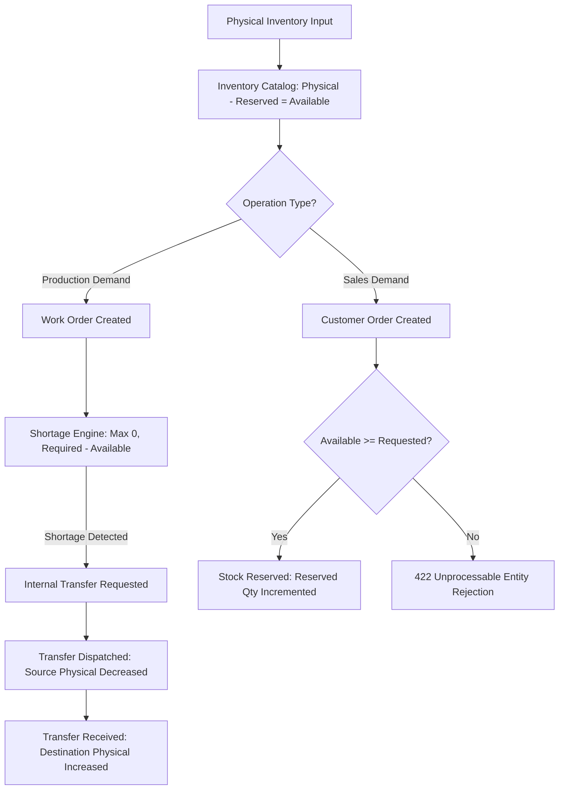
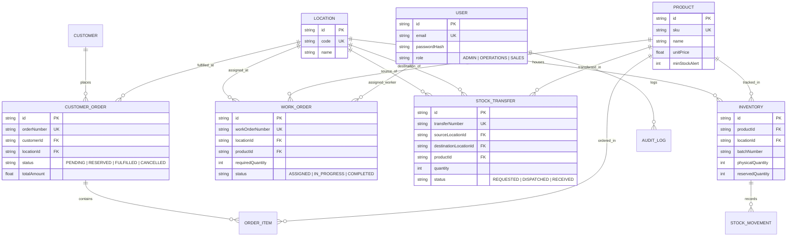

# 🏢 Mini Operations ERP

> **Round 2 Technical Case Study Application**  
> A Modular Monolith Operations ERP System engineered with **Node.js, Express, TypeScript, Prisma ORM, PostgreSQL, and React**.

---

## 📌 1. Project Title
**Mini Operations ERP & Inventory Control System**

---

## 📖 2. Project Overview
Mini Operations ERP is an internal enterprise platform built to handle multi-location warehouse management, inventory tracking, production work orders, inter-warehouse transfers, customer sales orders, and transactional stock reservations under ACID concurrency guarantees.

---

## 🎯 3. Business Problem
Traditional operations portals often suffer from race conditions, over-promising unreserved inventory, double-receiving stock transfers, and opaque material shortages. Mini Operations ERP solves these by enforcing:
* **Strict Stock Calculation Invariant**: $\text{Available Quantity} = \text{Physical Quantity} - \text{Reserved Quantity}$.
* **Real-time Work Order Shortage Engine**: $\text{Shortage} = \max(0, \text{Required Quantity} - \text{Available Stock at Location})$.
* **Stock Transfer Isolation**: Source physical stock decreases on dispatch; destination stock increases ONLY upon receipt. Double-receive is strictly prevented.
* **Database-Level Reservation Locks**: Concurrency protection prevents simultaneous customer order reservations from exceeding available inventory.

---

## 🔄 4. Core Business Workflow



---

## 🛠️ 5. Tech Stack & Architecture

* **Backend**: Node.js, Express.js, TypeScript
* **Database & ORM**: PostgreSQL (Neon Cloud) / SQLite (dev), Prisma ORM
* **Frontend**: React 18, TypeScript, Tailwind CSS, Lucide Icons, React Query, React Router
* **Security & Auth**: JWT (HS256 signature verification), Bcrypt password hashing (cost factor 10), Zod input validation, RBAC Middleware

---

## 🗄️ 6. Database Design & Mermaid ER Diagram



---

## 🔐 7. Authentication, Authorization & Role Permissions

The backend enforces strict **Role-Based Access Control (RBAC)** via JWT token verification and middleware execution (`authorize('ADMIN', 'OPERATIONS', 'SALES')`):

| Operation / Module | API Endpoint | Admin | Operations | Sales |
|---|---|:---:|:---:|:---:|
| **Physical Inventory Directory** | `GET /api/v1/inventory` | ✅ | ✅ | ✅ |
| **Add / Upsert Inventory Batch** | `POST /api/v1/inventory` | ✅ | ✅ | ❌ |
| **Adjust Stock Levels (IN/OUT)** | `POST /api/v1/inventory/adjust` | ✅ | ✅ | ❌ |
| **Create Work Order** | `POST /api/v1/work-orders` | ✅ | ❌ | ❌ |
| **View Work Orders & Shortage** | `GET /api/v1/work-orders` | ✅ | ✅ | ❌ |
| **Update Work Order Status** | `PATCH /api/v1/work-orders/:id/status` | ✅ | ✅ | ❌ |
| **Request Internal Transfer** | `POST /api/v1/transfers` | ✅ | ✅ | ❌ |
| **Dispatch / Receive Transfer** | `POST /api/v1/transfers/:id/*` | ✅ | ✅ | ❌ |
| **Create Sales Order & Reserve** | `POST /api/v1/customer-orders` | ✅ | ❌ | ✅ |
| **View Audit Logs** | `GET /api/v1/audit-logs` | ✅ | ❌ | ❌ |

---

## 🧮 8. Inventory & Business Metrics

* **Physical Quantity**: The total physical count stored in a warehouse batch.
* **Reserved Quantity**: Units held for unfulfilled customer orders.
* **Available Quantity**: Calculated dynamically:
  $$\text{Available Quantity} = \text{Physical Quantity} - \text{Reserved Quantity}$$
* **Work Order Shortage**: Calculated dynamically:
  $$\text{Shortage} = \max(0, \text{Required Quantity} - \text{Available Stock at Location})$$

---

## ⚡ 9. Transaction & Concurrency Locking Strategy

All operations modifying inventory execute inside database transactions (`prisma.$transaction`):
1. **Pessimistic State Checking**: State is locked and re-evaluated inside the transaction boundary before any mutation.
2. **Atomic Invariant Enforcement**: Prevents simultaneous requests (e.g., Request A=8 and Request B=8 on Available=10) from double-allocating stock.
3. **Double-Receive Guard**: Stock Transfer state transitions enforce `status === 'DISPATCHED'` inside transaction locks before marking `RECEIVED`.

---

## 🔑 10. Demo Credentials (Password for all: `Demo@123`)

| Role | Demo Email | Direct UI Quick Fill Button |
|---|---|:---:|
| **System Admin** | `admin@demo.com` | ✅ Available on Login Screen |
| **Operations Manager** | `ops@demo.com` | ✅ Available on Login Screen |
| **Sales Executive** | `sales@demo.com` | ✅ Available on Login Screen |

---

## 💻 11. Local Setup Instructions

```bash
# 1. Clone repository
git clone https://github.com/Ullas-webdev/Mini-ERP-CRM-Operations-Portal.git
cd Mini-ERP-CRM-Operations-Portal

# 2. Install dependencies
npm install

# 3. Setup Environment Variables
cp backend/.env.example backend/.env

# 4. Migrate and Seed Database
cd backend
npx prisma db push --force-reset
npx prisma db seed

# 5. Run Automated Test Suite
npx ts-node test_suite.ts

# 6. Start Backend Server
npm run dev

# 7. Start Frontend Application (in second terminal)
cd ../frontend
npm run dev
```

---

## 📄 12. API Documentation Reference

OpenAPI 3.0 Specification file: [`backend/openapi.json`](file:///c:/Users/GP65/Desktop/FUNDSROOM/backend/openapi.json)

---

## 📌 13. Assumptions & Known Limitations

1. **Local SQLite / Neon Postgres**: The application is configured to run on PostgreSQL in cloud production (Neon DB) and SQLite locally for 100% offline verification.
2. **Single Currency**: Monetary values are formatted in INR (`₹`).