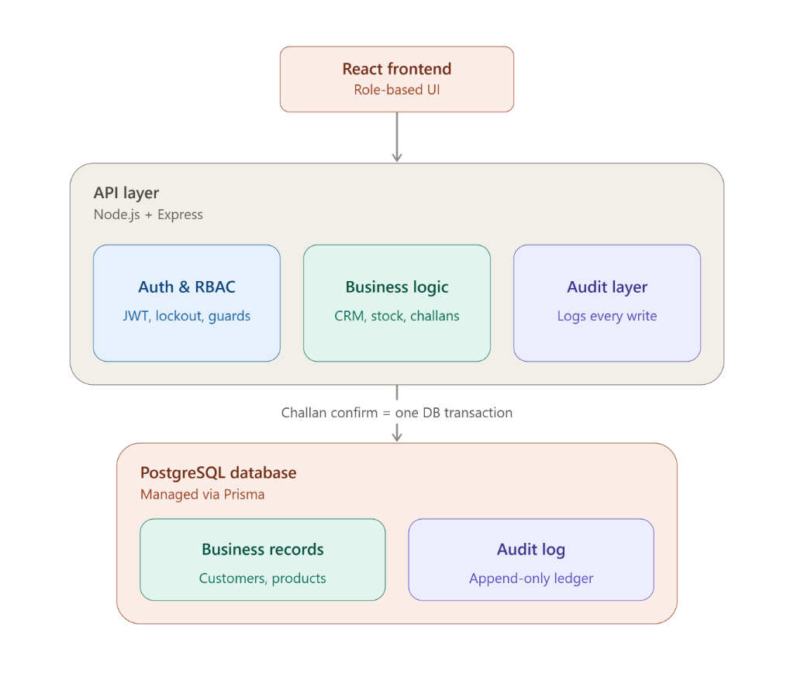
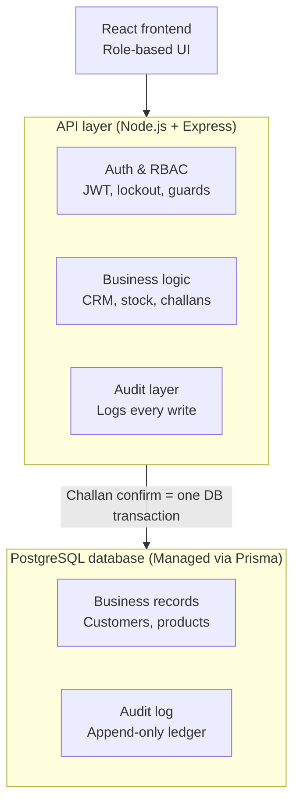

# Mini ERP + CRM Operations Portal

[](https://github.com/Ullas-webdev/Mini-ERP-CRM-Operations-Portal/actions/workflows/ci.yml)


A production-grade, full-stack TypeScript monorepo setup for an Enterprise Operations Portal featuring modular backend architecture (Express, Prisma, PostgreSQL) and dynamic frontend (React, Vite, Tailwind CSS, TanStack Query).

## 🌐 Live Production Deployments

| Component | Service | Live URL |
|---|---|---|
| 🌐 **Frontend App** | Vercel | [https://mini-erp-crm-operations-portal-fron-dun.vercel.app/](https://mini-erp-crm-operations-portal-fron-dun.vercel.app/) |
| ⚙️ **Backend REST API** | Render | [https://mini-erp-crm-operations-portal-z3uy.onrender.com](https://mini-erp-crm-operations-portal-z3uy.onrender.com) |
| 🗄️ **PostgreSQL Database** | Neon | `ep-little-sound-ayz549ew.c-5.us-east-2.aws.neon.tech` |

## 📁 Repository Structure

```
├── backend/            # Express + TypeScript API Server (Prisma, Zod, Pino)
├── frontend/           # React + Vite + Tailwind UI (TanStack Query, Axios)
├── docs/               # Architecture notes, ERD, and setup instructions
├── .env.example        # Environment variable template
└── package.json        # Monorepo scripts
```

## 🏗️ System Architecture





## 🚀 Local Development Setup

```bash
# 1. Copy environment file
cp .env.example .env
cp backend/.env.example backend/.env
cp frontend/.env.example frontend/.env

# 2. Run Backend (Terminal 1)
cd backend
npm install
npx prisma generate
npx prisma db push
npx prisma db seed
npm run dev

# 3. Run Frontend (Terminal 2)
cd frontend
npm install
npm run dev
```

Access services:
- **Frontend App**: `http://localhost:3000` (or `http://localhost:5173`)
- **Backend API**: `http://localhost:5000/api/v1/health`

## 📖 Documentation
- [Postman Collection v2.1 (API Endpoints & Edge Cases)](docs/postman_collection.json)
- [Deployment & Free-Tier Infrastructure Guide](docs/DEPLOYMENT.md)
- [Architecture Guide](docs/architecture.md)
- [Entity Relationship Diagram](docs/erd.md)
- [Local Setup Instructions](docs/setup.md)


by,
 ULLAS V for FUNDSROOM INFOTECH (48HR HACKATHON - ROUND 1)