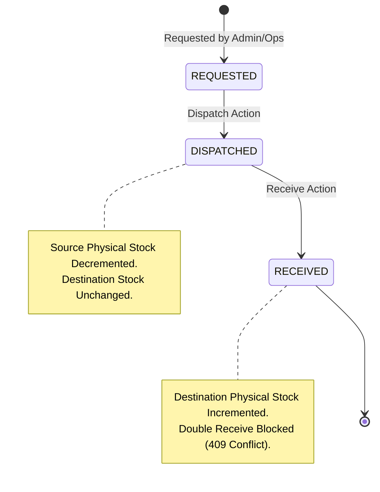

# 🏗️ Mini Operations ERP — Architecture & System Design

> **Technical Architecture Specification Document**  
> System: Mini Operations ERP  
> Architecture Pattern: Modular Monolith  

---

## 1. Modular Monolith Architecture

The application is structured as a **Modular Monolith** with clean separation between HTTP controllers, authorization gateways, input validation schemas, service logic, and database transaction boundaries.

```
backend/
├── src/
│   ├── config/             # Environment validation (Zod schema)
│   ├── controllers/        # Request handling & HTTP response shaping
│   │   ├── authController.ts
│   │   ├── locationController.ts
│   │   ├── inventoryController.ts
│   │   ├── workOrderController.ts
│   │   ├── transferController.ts
│   │   └── customerOrderController.ts
│   ├── middleware/         # Security, Auth, Logging & Validation
│   │   ├── auth.ts         # JWT verification & RBAC authorization
│   │   ├── validateRequest.ts # Zod schema validation
│   │   └── errorHandler.ts # Centralized error handling
│   ├── routes/             # REST route declarations
│   └── utils/              # Prisma client, errors, logging
```

---

## 2. Core Business Invariants & Math Formulas

### 2.1 Available Quantity Formula
Available stock is computed dynamically per location and batch:
$$\text{Available Quantity} = \text{Physical Quantity} - \text{Reserved Quantity}$$

### 2.2 Work Order Shortage Engine Formula
Material shortage is computed dynamically across available stock at a location:
$$\text{Shortage} = \max(0, \text{Required Quantity} - \text{Available Stock at Location})$$

---

## 3. Transfer Lifecycle State Machine



---

## 4. Transaction & Concurrency Strategy

All inventory-modifying endpoints execute inside database transactions (`prisma.$transaction`).

### Race Condition Protection
When two requests attempt to reserve stock simultaneously from $\text{Available} = 10$:
- **Request A (8 units)** and **Request B (8 units)** enter concurrent transactions.
- Transaction A reads $\text{Available} = 10 \ge 8$, increments `reservedQuantity` to 8, and commits.
- Transaction B re-evaluates $\text{Available} = 2 < 8$, rejects with `422 Unprocessable Entity`, and rolls back cleanly.
- Result: Exactly one reservation succeeds; final $\text{Reserved} = 8$, $\text{Available} = 2$.
