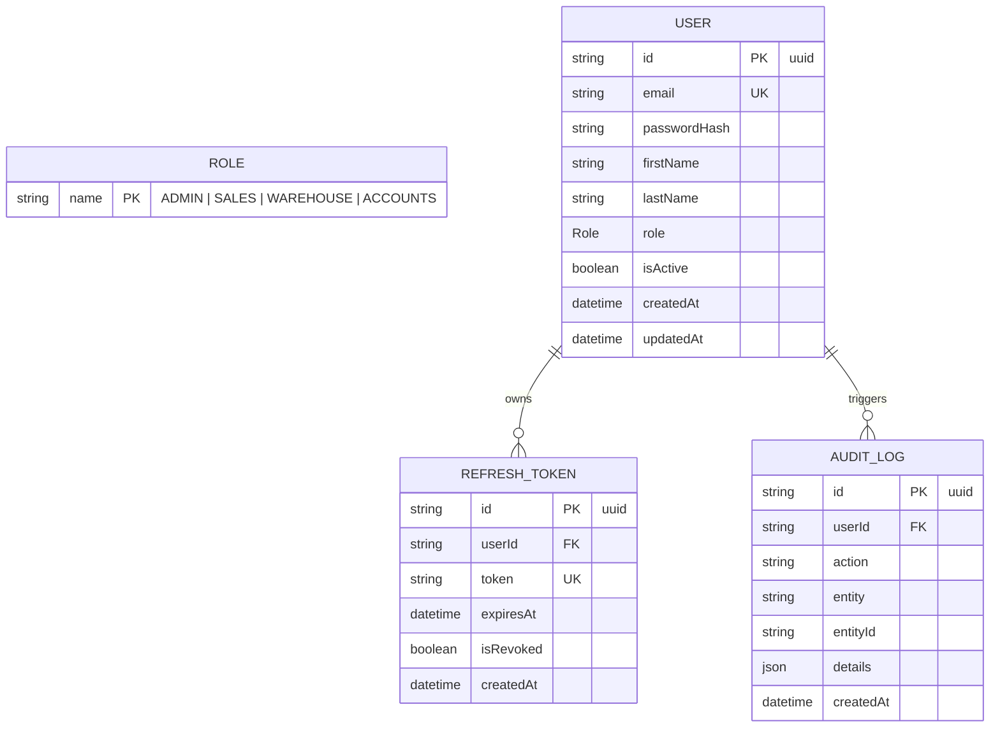

# Entity Relationship Diagram (ERD)

This document contains the foundational entity schema for the Mini ERP + CRM Operations Portal database managed via Prisma ORM on PostgreSQL.

## Schema Entities Summary

1. **User**: Represents platform users associated with explicit access roles (`ADMIN`, `SALES`, `WAREHOUSE`, `ACCOUNTS`).
2. **RefreshToken**: Secure persistence for rotation and revocation of JWT auth sessions.
3. **AuditLog**: Central tracking for administrative and critical ERP/CRM data mutations.
